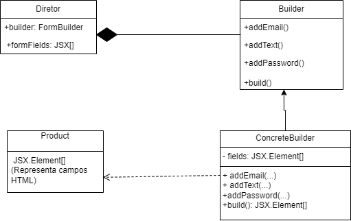

# Builder

## Introdução

O padrão de projeto Builder é utilizado para construir objetos complexos passo a passo, separando a lógica de construção da representação final do objeto. Em aplicações práticas, isso permite montar diferentes variações de um mesmo tipo de objeto utilizando o mesmo processo de construção.

<<<<<<< HEAD
No exemplo que será apresentado, temos a criação de um formulário em React. A classe FormBuilder implementa os métodos responsáveis por adicionar diferentes tipos de campos (input de texto, e-mail, senha etc.) e atua como o construtor concreto (ConcreteBuilder). Cada um desses métodos retorna o próprio objeto para permitir o encadeamento de chamadas, o que é uma característica comum no padrão Builder.

O componente CadastroPage assume o papel de diretor (Director), responsável por controlar a ordem e os tipos de campos adicionados ao formulário, mas sem lidar diretamente com os detalhes de como esses campos são construídos. O resultado da construção, ou seja, o array de elementos JSX que representam os campos do formulário, é o produto (Product).

Esse padrão traz benefícios importantes, como organização, reutilização de lógica de construção e separação clara de responsabilidades, o que facilita a manutenção e a evolução do código — especialmente útil em formulários complexos ou com variações dinâmicas.
=======
<br>
>>>>>>> 146d267bd53f18c174f0ce2dea0c870aca6d71fd

## Modelagem



<font size="3"><p style="text-align: center"><b>Figura 1: </b>Modelagem do Padrão criacional de projeto Builder aplicado na criação da página de cadastro.</p></font>
<br>

### Código
### Builder (Interface)

```jsx

class IFormBuilder {
  addEmail(label, placeholder) {}
  addText(label, placeholder, name) {}
  addPassword(label, placeholder, name) {}
  build() {}
}
```

### ConcreteBuilder

```jsx

import React from 'react';

export class FormBuilder {
  constructor() {
    this.fields = [];
  }

  addEmail(label, placeholder) {
    this.fields.push(
      <div key="email" className="form-group">
        <label>{label}</label>
        <input type="email" placeholder={placeholder} className="form-control" />
      </div>
    );
    return this;
  }

  addText(label, placeholder, name) {
    this.fields.push(
      <div key={name} className="form-group">
        <label>{label}</label>
        <input type="text" placeholder={placeholder} className="form-control" />
      </div>
    );
    return this;
  }

  addPassword(label, placeholder, name) {
    this.fields.push(
      <div key={name} className="form-group password-group">
        <label>{label}</label>
        <div className="password-wrapper">
          <input type="password" placeholder={placeholder} className="form-control" />
          <span className="icon">👁️‍🗨️</span>
        </div>
      </div>
    );
    return this;
  }

  build() {
    return this.fields;
  }
}

```

### Product

```jsx

export const FormFields = (fields) => {
  return <>{fields}</>;
};

## Diretor

const CadastroPage = () => {
  const builder = new FormBuilder();
  const formFields = builder
    .addEmail('Email Institucional', 'Insira seu email institucional')
    .addText('Nome', 'Insira o seu nome', 'nome')
    .addText('Telefone', 'Insira seu telefone', 'telefone')
    .addPassword('Senha', 'Insira sua senha', 'senha')
    .addPassword('Repita sua senha', 'Repita sua senha', 'repetirSenha')
    .build();

  return (
    <div className="container">
      <button className="back-button">← Voltar</button>
      <div className="form-container">
        
        <form className="form">
          {formFields}
          <button type="submit" className="submit-button">Cadastrar</button>
        </form>
      </div>
    </div>
  );
};
```

Resumo do Codigo usando o Gof **Builder**

| Papel                   | Classe/Elemento                     | Descrição                                                                         |
| ----------------------- | ----------------------------------- | --------------------------------------------------------------------------------- |
| **Builder (Interface)** | `FormBuilder` (interface implícita) | Define os métodos para adicionar campos e construir o formulário.                 |
| **ConcreteBuilder**     | `FormBuilder`                       | Implementa os métodos do builder, armazenando os campos e montando o formulário.  |
| **Product**             | `JSX.Element[]`                     | O formulário composto de campos JSX (e.g., `<input>`).                            |
| **Director**            | `CadastroPage`                      | Usa o `FormBuilder` para construir um formulário com uma configuração específica. |

<br>


## Referências Bibliográficas

> GAMMA, Erich et al. Builder – Padrões de Projeto. Refactoring Guru. Disponível em: https://refactoring.guru/design-patterns/builder. Acesso em: 01 maio 2025.

>SERRANO, Milena. Padradões de Projeto. Universidade de Brasília, 2025. Disponível em: https://aprender3.unb.br/pluginfile.php/3075185/mod_page/content/1/Arquitetura%20e%20Desenho%20de%20Software%20-%20Aula%20GoFs%20Criacionais%20-%20Profa.%20Milene.pdf. Acesso em: 02 jun. 2025.

>SOURCE MAKING. Builder Design Pattern. Disponível em: https://sourcemaking.com/design_patterns/builder. Acesso em: 02 jun. 2025.

## Histórico de Versão


<div align="center">
    <table>
        <tr>
            <th>Data</th>
            <th>Versão</th>
            <th>Descrição</th>
            <th>Autor</th>
            <th>Data da Revisão</th>
            <th>Descrição da revisão</th>
            <th>Revisor</th>
        </tr>
        <tr>
            <td>02/06/2025</td>
            <td>1.0</td>
            <td>Adicionando o artefato builder</td>
            <td><a href="https://github.com/Karolina91">Karolina Vieira</a> e <a href="https://github.com/paolaalim">Paola Nascimento</a></td>
            <td>00/00/0000</td>
            <td></td>
            <td><a href="https://github.com/SEU_GIT]">SEU_NOME</a></td>
        </tr>
    </table>
</div>
