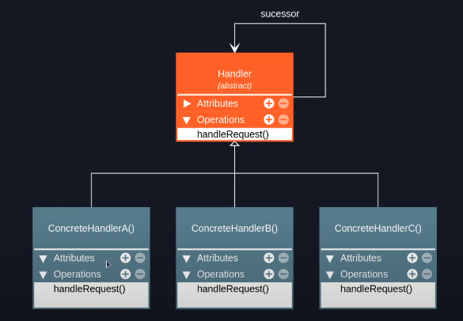
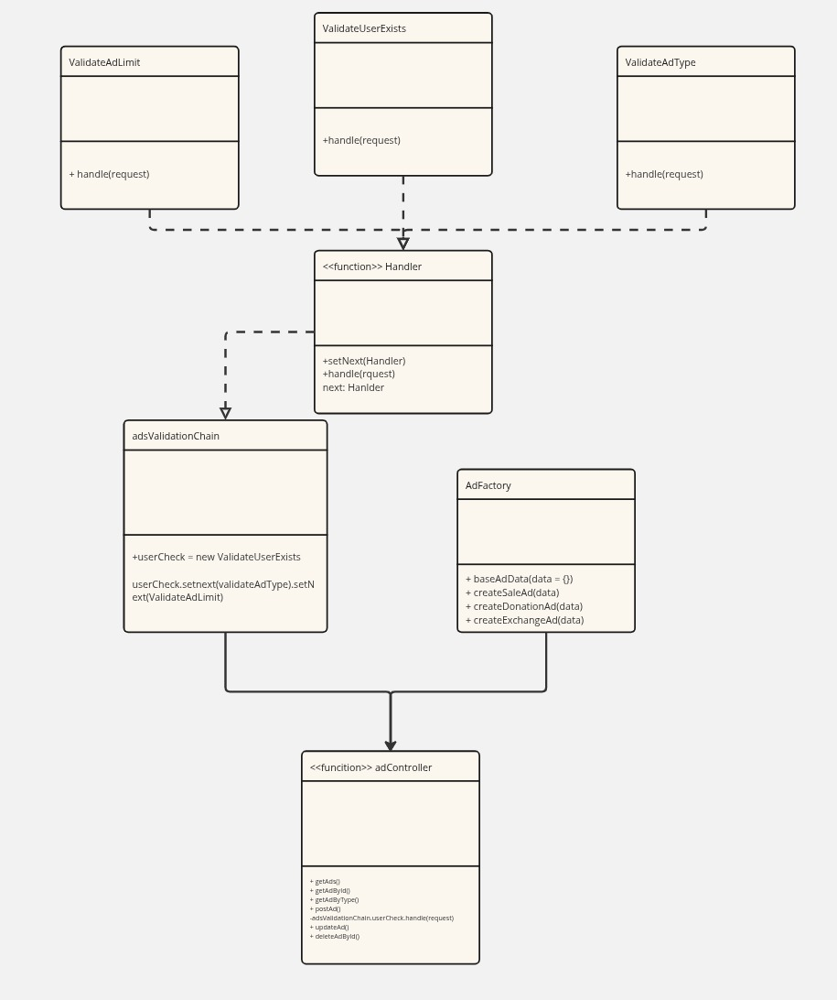

## Chain Of Responsability
O Chain of Responsibility (ou Cadeia de Responsabilidade) é um padrão de design comportamental que tem como objetivo evitar o acoplamento entre o emissor de uma solicitação e seu receptor, permitindo que múltiplos objetos possam processar essa solicitação de forma encadeada. Nesse padrão, diversos objetos são organizados em uma cadeia, e cada um deles possui a oportunidade de lidar com a requisição ou passá-la adiante para o próximo objeto da cadeia. Assim, a responsabilidade pelo tratamento da solicitação é distribuída dinamicamente.

## Estrutura do Chain of Responsability



#### 1. Handler (Manipulador):

- No topo da hierarquia, temos uma classe ou interface abstrata chamada Handler. Ele define uma interface para lidar com as requisições. Possui um método para processar a requisição, geralmente chamado handleRequest(). E contém uma referência para o "sucessor" (successor), que é o próximo manipulador na cadeia. Isso é fundamental para a capacidade de encadeamento do padrão. A seta de successor aponta de volta para Handler, indicando que o sucessor também é um Handler.

#### 2. ConcreteHandler (Manipulador Concreto):

- Existem várias classes concretas que herdam ou implementam o Handler abstrato. No diagrama, são representadas por ConcreteHandlerA, ConcreteHandlerB e ConcreteHandlerC. Cada ConcreteHandler é responsável por lidar com um tipo específico de requisição ou por uma parte do processamento da requisição. Cada handler implementa o método handleRequest() que processa a requisição se for capaz de fazê-lo. E depois passa a requisição para o seu sucessor na cadeia se não for capaz de processá-la ou se o processamento requerer mais etapas. Isso é feito chamando o método handleRequest() do sucessor.

## Porque eu decidi usar o Chain of Responsability?

Em nosso projeto, a classe `Anúncio` possui 3 classes filhas, podendo ser anúncios de doação, venda ou troca. Ao criar esse registro no banco de dados de forma organizada ao lidar com uma requisição, o padrão Chain of Responsability permite organizar e desacoplar as diversas etapas de validação exigidas antes da criação de um anúncio. Cada validação — verificar se o usuário existe, checar o tipo do anúncio e garantir que o limite de anúncios ativos não foi ultrapassado — possui uma lógica específica e independente, mas que deve ser executada de forma sequencial e ordenada. Utilizando esse padrão, é possível encapsular cada validação em uma classe separada, promovendo a responsabilidade única e facilitando a manutenção e extensibilidade do sistema.

## Implementação do padrão no Projeto



<p align="center"><em>Autores(as): <a href="https://github.com/arthur-suares">Arthur Suares</a> e <a href="https://github.com/Jagaima">Davi Nobre</a>, 2025.</em></p>

## Código com o padrão Chain of Responsability
A seguir, é apresentado a implementação do Chain of Responsability para diferentes tipos de anúncios.

## Classe Handler Abstrata
```javascript
class Handler {
  setNext(handler) {
    this.next = handler;
    return handler;
  }

  async handle(request) {
    if (this.next) {
      return this.next.handle(request);
    }
    return true;
  }
}

module.exports = Handler;
```
<p align="center"><em>Autores(as): <a href="https://github.com/arthur-suares">Arthur Suares</a> e <a href="https://github.com/Jagaima">Davi Nobre</a>, 2025.</em></p>

## Subclasses Handler Concretas

`ValidateAdLimit`

```javascript
const Handler = require('./baseHandler');
const db = require('../models');

class ValidateAdLimit extends Handler {

  async handle(request) {
    const count = await db.Ad.count({
      where: {
        userId: request.userId,
        isActive: true
      }
    });
    if (count >= 10) {
      throw new Error('Limite de anúncios ativos atingido (máximo 10).');
    }
    return super.handle(request);
  }
}

module.exports = ValidateAdLimit;
```
<p align="center"><em>Autores(as): <a href="https://github.com/arthur-suares">Arthur Suares</a> e <a href="https://github.com/Jagaima">Davi Nobre</a>, 2025.</em></p>

`ValidateUserExists`

```javascript
const Handler = require('./baseHandler');
const db = require('../models');

class ValidateUserExists extends Handler {
  async handle(request) {
    if (!request.userId) {
      throw new Error('Campo "userId" é obrigatório.');
    }

    const user = await db.User.findByPk(request.userId);
    if (!user) {
      throw new Error('Usuário não encontrado.');
    }

    return super.handle(request);
  }
}

module.exports = ValidateUserExists;
```
<p align="center"><em>Autores(as): <a href="https://github.com/arthur-suares">Arthur Suares</a> e <a href="https://github.com/Jagaima">Davi Nobre</a>, 2025.</em></p>

`ValidateAdType`

```javascript
const Handler = require('./baseHandler');
const adFactory = require('../factory/adFactory');

class ValidateAdType extends Handler {
  async handle(request) {
    if (!request.type || typeof request.type !== 'string') {
      throw new Error('Tipo de anúncio não especificado ou inválido.');
    }

    const type = request.type.toLowerCase();
    const factoryMethod = `create${type.charAt(0).toUpperCase() + type.slice(1)}Ad`;

    const validTypes = Object.keys(adFactory); // ['createSaleAd', 'createDonationAd', 'createExchangeAd']

    if (!validTypes.includes(factoryMethod)) {
      throw new Error('Tipo de anúncio inválido.');
    }

    request.type = type; // padroniza para minúsculo (caso esteja em maiúsculas)
    return super.handle(request);
  }
}

module.exports = ValidateAdType;
```

<p align="center"><em>Autores(as): <a href="https://github.com/arthur-suares">Arthur Suares</a> e <a href="https://github.com/Jagaima">Davi Nobre</a>, 2025.</em></p>

---
E criamos também um módulo que simplesmente encapsula a lógica para a criação dos anúncio.

```javascript
const ValidateUserExists = require('./validaterUserReal');
const ValidateAdType = require('./validateType');
const ValidateAdLimit = require('./validateAdLimit');

const userCheck = new ValidateUserExists();
const typeCheck = new ValidateAdType();
const limitCheck = new ValidateAdLimit();

userCheck.setNext(typeCheck).setNext(limitCheck);

module.exports = userCheck;
```

## Uso do Chain Of Responsability

Exemplo de como usar o chain para conferir se tudo está correto com um anúncio.

```javascript
const adsValidationChain = require('../chainOfResponsabilty/adsValidationChain');

async function postAd(req, res, next) {
  try {
    await adsValidationChain.handle(req.body);

    const { type } = req.body;
    const capitalizedType = type.charAt(0).toUpperCase() + type.slice(1).toLowerCase();
    const factory = adFactory[`create${capitalizedType}Ad`];

    if (typeof factory !== 'function') {
      throw new Error(`Factory para tipo '${type}' não encontrada.`);
    }

    const newAd = await factory(req.body);
    res.status(201).json(newAd);

  } catch (err) {
    console.error('❌ ERRO AO CRIAR ANÚNCIO:', err.message);
    next(err);
  }
}
```

<p align="center"><em>Autores(as): <a href="https://github.com/arthur-suares">Arthur Suares</a> e <a href="https://github.com/Jagaima">Davi Nobre</a>, 2025.</em></p>

## Histórico de Versão

<div align="center">
    <table>
        <tr>
            <th>Data</th>
            <th>Versão</th>
            <th>Descrição</th>
            <th>Autor</th>
            <th>Data da Revisão</th>
            <th>Revisor</th>
            <th>Descrição de Revisão</th>
        </tr>
        <tr>
            <td>02/06/2025</td>
            <td>1.0</td>
            <td>Acrescentando diagrama explicações feitas por Arthur e Davi</td>
            <td><a href="https://github.com/arthur-suares">Arthur Suares</a> e <a href="https://github.com/Jagaima">Davi Nobre</a></td>
            <td>02/06/2025</td>
            <td><a href="https://github.com/Jagaima">Davi Nobre</a></td>
            <td>Foi revisado o diagrama de classes da dupla que faço parte, seu posicionamento no documento e se era possível acessa-lo</td>
        </tr>
    </table>
</div>