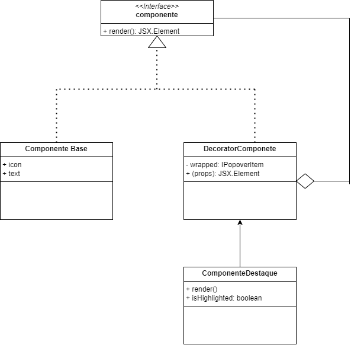

# Decorator

## Introdução
O padrão Decorator tem como principal objetivo adicionar responsabilidades a um objeto de forma dinâmica, sem alterar sua estrutura original ou recorrer à herança. Ele permite que funcionalidades adicionais sejam incorporadas a objetos individuais, promovendo maior flexibilidade e aderência ao princípio aberto/fechado (Open/Closed Principle), um dos princípios do SOLID. Por meio do uso do Decorator, é possível empilhar comportamentos de maneira modular, criando soluções elegantes para problemas que exigem extensibilidade em tempo de execução. Sua aplicação é comum em interfaces gráficas, frameworks e bibliotecas onde a composição de funcionalidades deve ser feita de forma desacoplada e transparente ao sistema.

Durante o desenvolvimento da interface, surgiu a necessidade de destacar visualmente certos elementos em situações específicas, como forma de orientar a atenção do usuário para ações prioritárias ou mais relevantes. Para evitar a criação de múltiplas variações de um mesmo componente e, ao mesmo tempo, preservar sua estrutura original, optamos por aplicar o padrão de projeto Decorator. Essa escolha nos permitiu encapsular os elementos visuais com camadas adicionais de estilo, de maneira dinâmica e flexível. Por meio dessa abordagem, foi possível aplicar realces visuais apenas quando necessário, sem modificar o comportamento ou a estrutura do componente principal. Essa estratégia tornou a interface mais modular, facilitando a manutenção e a extensão futura, além de garantir maior aderência aos princípios de reutilização e coesão do projeto.

## Modelagem



<font size="3"><p style="text-align: center"><b>Figura 1: </b>Modelagem do Decorator aplicado aos cards da aplicação.</p></font>

## Código

Segue abaixo o código demonstrando a implementação do Decorator:

### Componente base 

```jsx

const PopoverItem = ({ icon, text, isFirst = false, isLast = false }) => (
  <button
    className={
      flex items-center gap-2 w-full px-4 py-2 text-sm text-sky-900 
      ${isFirst ? "rounded-t-xl" : ""}
      ${isLast ? "rounded-b-xl" : ""}
      hover:bg-sky-50
    }
  >
    {icon}
    <span>{text}</span>
  </button>
);
```


### Decorator

```jsx

const withHighlight = (WrappedComponent) => {
  return ({ isHighlighted = false, ...props }) => {
    const highlightClass = isHighlighted ? "bg-yellow-100 font-semibold" : "";
    return (
      <div className={highlightClass}>
        <WrappedComponent {...props} />
      </div>
    );
  };
};
```

### Componente principal

```jsx

const UserPopover = () => {
  return (
    <Popover.Root>
      <Popover.Trigger asChild>
        <Button variant="outline" className="flex items-center gap-2">
          <PersonIcon />
          <ChevronDownIcon />
        </Button>
      </Popover.Trigger>

      <Popover.Portal>
        <Popover.Content
          sideOffset={5}
          className="bg-white border border-gray-300 rounded-xl shadow-lg w-48 p-0"
        >
          <div className="flex flex-col divide-y divide-gray-300">
            <HighlightedPopoverItem
              icon={<PersonIcon />}
              text="Meu perfil"
              isFirst
              isHighlighted
            />
            <PopoverItem icon={<PlusCircledIcon />} text="Criar anúncio" />
            <PopoverItem icon={<BookmarkIcon />} text="Meus anúncios" />
            <PopoverItem icon={<ExitIcon />} text="Sair" isLast />
          </div>
        </Popover.Content>
      </Popover.Portal>
    </Popover.Root>
  );
};
```
### Resumo: Uso do Padrão Decorator em Componentes React

Este resumo descreve como o padrão de projeto **Decorator** foi aplicado em uma interface React para adicionar estilos visuais de forma dinâmica e reutilizável.


## Referências Bibliográficas

> GAMMA, Erich et al. Factory Method – Padrões de Projeto. Refactoring Guru. Disponível em: https://refactoring.guru/pt-br/design-patterns/factory-method. Acesso em: 01 maio 2025.

>SERRANO, Milena. Padradões de Projeto. Universidade de Brasília, 2025. Disponível em: https://aprender3.unb.br/pluginfile.php/3075186/mod_page/content/1/Arquitetura%20e%20Desenho%20de%20Software%20-%20Aula%20GoFs%20Estruturais%20-%20Profa.%20Milene.pdf. Acesso em: 02 jun. 2025.

>SOURCE MAKING. Decorator design pattern. Disponível em: https://sourcemaking.com/design_patterns/decorator. Acesso em: 02 jun. 2025.

## Histórico de Versão


<div align="center">
    <table>
        <tr>
            <th>Data</th>
            <th>Versão</th>
            <th>Descrição</th>
            <th>Autor</th>
            <th>Data da Revisão</th>
            <th>Descrição da revisão</th>
            <th>Revisor</th>
        </tr>
        <tr>
            <td>02/06/2025</td>
            <td>1.0</td>
            <td>Adicionando o porque usar o padrão, os códigos e imagem</td>
            <td><a href="https://github.com/Karolina91">Karolina Vieira</a> e <a href="https://github.com/paolaalim">Paola Nascimento</a></td>
            <td>00/00/0000</td>
            <td></td>
            <td><a href="https://github.com/SEU_GIT]">SEU_NOME</a></td>
        </tr>
    </table>
</div>