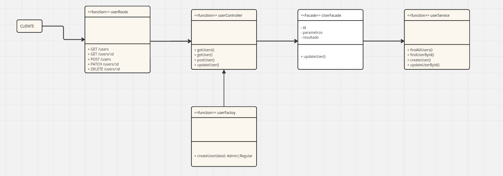
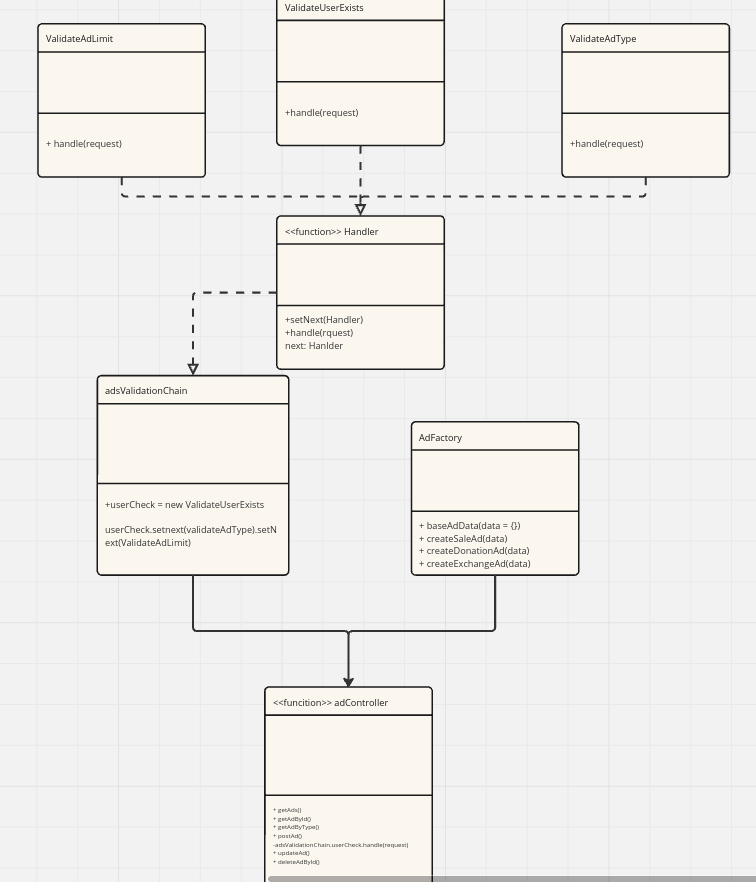

## Factory

## Introdução

O Factory Method é um dos padrões de design criacionais utilizados na engenharia de software. Ele fornece uma interface para criar objetos em uma superclasse, mas permite que as subclasses alterem o tipo de objetos que serão criados. Esse padrão promove o baixo acoplamento e a alta escalabilidade, sendo fundamental para sistemas que precisam ser flexíveis e fáceis de manter. Como o nome indica ele tem uma função semelhante a um molde mestre, componente essencial de fabricação de peças. 


## Metodologia e motivos de escolha

O factory por sua essência lembra muito o sistema de classes amplamente utilizado mas com alterações que durante o desenvolvimento se notaram significantes. 

 O Factory Method segue uma estrutura simples e eficiente:

    - Produto (Product): Interface ou classe abstrata que define os métodos que os produtos concretos devem implementar.

    - Produtos Concretos (Concrete Products): Implementações específicas da interface do produto.

    - Criador (Creator): Classe abstrata que declara o método fábrica, que retorna um objeto do tipo Product.

    - Criadores Concretos (Concrete Creators): Subclasses que sobrescrevem o método fábrica para retornar um tipo específico de produto.


Baseando-se nisso foi proposto ideias de onde se poderia utilizar o Factory no projeto, e logo se veio a proposta de usar no sistema de anuncios. Anuncios para o projeto se configura basicamente em um serviço de transação, esse serviço de transação entretanto se prova único em cada tipo por ter propriedades distintas pra sua finalidade (troca, venda e doação). Como apesar de serem transações, em todas são comerciais e uma se baseia em um valor arbitrário (no caso da troca) é necessário um grau de desacomplamento onde a lógica de criação de objetos é isolada do código que os utiliza. Em seguida voltamos ao sistema de Factory para usuários, uma vez que um usário admin apesar de ter este titulo, exibe um comportamento totalmente diferente do usuário regular da plataforma, apesar de ter sua navegação no site do mesmo modo. 

Outros motivos para essa escolha neste ponto são o fato de que anuncios exigem uma configuração complexa que não poderia estar espalhada em multiplas funções e locais do código pois, apesar do factory adicionar um grau de complexidade na estrutura do código, o faz mais customizavel[1](#ref1) o que é importante pois pode acontecer também porque anúncio pode crescer e ter funções diferentes ainda que sendo transação (por exemplo futuramente se necessário alguém pode criar um tipo de transação empréstimo ou alugues, que também é um anúncio E transação).Portanto como estamos tratando de uma aplicação viva (site de vendas) e tendo em vista a evolução gradual dos mesmos já ativos no mercado, o padrão é util pela dificuldade de se definir exatamente que tipo de restrições algumas funcionalidades ou objetos devem ter, algo que é um grande motivador do uso do Factory.[2](#ref2)

## Implementação do padrão no Proejto

Aqui temos modos como foi pensando o uso do factory no projeto: 



<p align="center"><em>Autores(as): <a href="https://github.com/arthur-suares">Arthur Suares</a> e <a href="https://github.com/Jagaima">Davi Nobre</a>, 2025.</em></p>



<p align="center"><em>Autores(as): <a href="https://github.com/arthur-suares">Arthur Suares</a> e <a href="https://github.com/Jagaima">Davi Nobre</a>, 2025.</em></p>


## Código com padrão Factory

A seguir está os momentos em que foi usado o padrão Factory no código: 

## userFactory

```javascript
const bcrypt = require('bcrypt');

class AdminUser {
  constructor(data) {
    this.name = data.name;
    this.email = data.email;
    this.phone = data.phone;
    this.password = data.password;
    this.role = 'admin';
  }

  permissions() {
    return ['create', 'read', 'update', 'delete', 'manageUsers', 'manageTrades'];
  }

  toDbObject() {
    return {
      name: this.name,
      email: this.email,
      phone: this.phone,
      password: bcrypt.hashSync(this.password, 10),
      role: this.role
    };
  }
}

class RegularUser {
  constructor(data) {
    this.name = data.name;
    this.email = data.email;
    this.phone = data.phone;
    this.password = data.password;
    this.role = 'user';
  }

  permissions() {
    return ['read', 'createTrades'];
  }

  toDbObject() {
    return {
      name: this.name,
      email: this.email,
      phone: this.phone,
      password: bcrypt.hashSync(this.password, 10),
      role: this.role
    };
  }
}

class UserFactory {
  static createUser(data) {
    if (data.role === 'admin') {
      return new AdminUser(data);
    }
    return new RegularUser(data);
  }
}

module.exports = UserFactory;
```


<p align="center"><em>Autores(as): <a href="https://github.com/arthur-suares">Arthur Suares</a> e <a href="https://github.com/Jagaima">Davi Nobre</a>, 2025.</em></p>

## adFactory


``` javascript
const db = require('../models');

function baseAdData(data = {}) {
    return {
      title: data.title || 'Título padrão',
      description: data.description || 'Descrição padrão',
      pickupLocation: data.pickupLocation || 'Local padrão',
      userId: data.userId, // aqui você garante o ID
      ...data // pode vir com outros campos
    };
  }
  
  async function createSaleAd(data) {
    return await db.Ad.create({
      ...baseAdData(data),
      type: 'sale',
    });
  }
  
  async function createDonationAd(data) {
    return await db.Ad.create({
      ...baseAdData(data),
      type: 'donation',
    });
  }
  
  async function createExchangeAd(data) {
    return await db.Ad.create({
      ...baseAdData(data),
      type: 'exchange',
    });
  }

  module.exports = {
  createSaleAd,
  createDonationAd,
  createExchangeAd,
};

```

<p align="center"><em>Autores(as): <a href="https://github.com/arthur-suares">Arthur Suares</a> e <a href="https://github.com/Jagaima">Davi Nobre</a>, 2025.</em></p>


## Uso do Factory.

Tendo em vista que o factory apenas faz a montagem do usuário, até o momento de desenvolvimento que alcançamos nesse projeto, podemos ver o uso de factory na controladora, para que possa ser feito os processos de uso do banco de dados.


```javascript

const login = async (req, res) => {
  const { email, password } = req.body;
  const authService = AuthService.getInstance();
  const strategy = new EmailUnbLoginStrategy();

  try {
    const user = await authService.login(strategy, { email, password });
    const userObj = UserFactory.createUser(user);  "usamos aqui como pode ser visto"

    res.status(200).json({
      user: {
        id: user.id,
        name: user.name,
        email: user.email,
        role: user.role,
        permissions: userObj.permissions()
      }
    });
  } catch (error) {
    res.status(401).json({ error: error.message });
  }
};

```

<p align="center"><em>Autores(as): <a href="https://github.com/arthur-suares">Arthur Suares</a> e <a href="https://github.com/Jagaima">Davi Nobre</a>, 2025.</em></p>

## Bibliografia

> "Temaj, Granit. "Factory design pattern." Consulté le (2023)": Consultado no mês de maio de 2025 e disponível em: <https://www.researchgate.net/profile/Granit_Temaj/publication/350611051_Factory_Design_Pattern/links/6068df26458515614d32ebdd/Factory-Design-Pattern.pdf>


> "Refactoring.guru: Design Patterns" : Consultado no mês de junho de 2025 e disponível em: <https://refactoring.guru/design-patterns>

## Bibliografia 

> <a id="ref1"></a>> [1] Arbana Kadriu, Meral Mehmeti The Factory Design Pattern - Research Paper (2017)

> <a id="ref2"></a>> [2] Rafał Ireno The Dynamic Factory - New Possibilities For Factory Design Pattern - Conference
Paper (2014)


## Histórico de Versão

<div align="center">
    <table>
        <tr>
            <th>Data</th>
            <th>Versão</th>
            <th>Descrição</th>
            <th>Autor</th>
            <th>Data da Revisão</th>
            <th>Revisor</th>
            <th>Descrição de Revisão</th>
        </tr>
        <tr>
            <td>02/06/2025</td>
            <td>1.0</td>
            <td>Acrescentando diagrama e explicações feitas por Arthur e Davi</td>
            <td><a href="https://github.com/arthur-suares">Arthur Suares</a> e <a href="https://github.com/Jagaima">Davi Nobre</a></td>
            <td>02/06/2025</td>
            <td><a href="https://github.com/arthur-suares">Arthur</a></td>
            <td>Foi revisado o diagrama de classes da dupla que faço parte, seu posicionamento no documento e se era possível acessa-lo, como participei de co-autoria desta etapa, não vejo o que mais pode ser incluido ou excluido com exceção de alguns erros de concordância corrigidos.</td>
        </tr>
    </table>
</div>