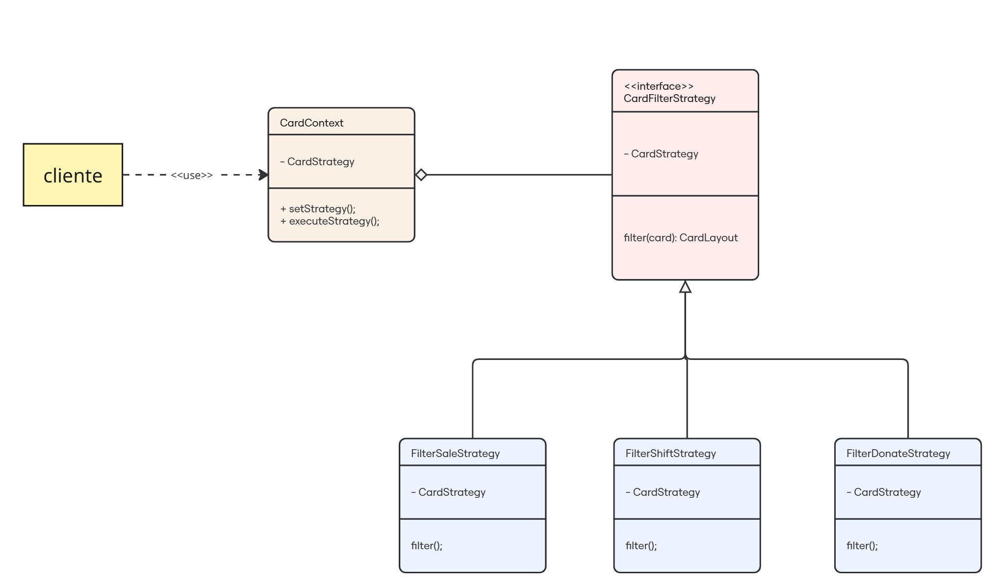

# Cards

## Introdução

O padrão de projeto Strategy permite com que se faça uso de algoritimos que variem dependendo do tipo de requisição de um cliente. Isso ajuda na manuntenabilidade do código por organizar o código de maneira coesa e objetiva.

Em vista disso, esse padrão de projeto foi utilizado nesta sessão com o objetivo alterar a lógica de filtro de cards em tempo de execução para facilitar a experiência do usuário e a manutenibilidade do código. Nesse sentido, a exibição dependerá da ação do usuário, o qual poderá selecionar entre os tipos de cards `venda, troca ou doação`.

## Modelagem

<b>Figura 1: </b>Modelagem do Padrão de projeto Strategy aplicado aos filtros dos cards da aplicação.

## Código

Segue abaixo o código demonstrando a implementação do padrão Strategy, porém adaptado para o paradigma funcional:

### Classe Abstrata

A função `` tem o objetivo de fornecer o mesmo método à suas subclasses correspondentes.

#### ``

 
 

### Sublasses Concretas

As substrasses concretas possuem o objetivo de gerar componentes de seus respectivos tipos. Portanto, por exemplo, a subclasse `CardPrimaryConcrete` irá importar e retornar o componente `CardPrimary` e o mesmo ocorre com as outras subclasses a seguir.

#### ``

 
 

#### ``

 
 

#### ``

 
 

### Fábrica

A fábrica `CardFactory` tem como objetivo guardar a lógica de criação de cards dentro de si. Logo, dependendo da variável a ser recebida, ele irá chamar uma subclasse concreta a qual irá renderizar seu respectivo componente.

#### ``

# Bibliografia

> GAMMA, Erich et al. Factory Method – Padrões de Projeto. Refactoring Guru. Disponível em: https://refactoring.guru/pt-br/design-patterns/factory-method. Acesso em: 31 maio 2025.

> SOFTPLAN. Descomplicando o Strategy. Softplan – Tech Writers. Disponível em: https://www.softplan.com.br/tech-writers/descomplicando-o-strategy/. Acesso em: 31 maio 2025.

## Histórico de Versão

    <table>
        <tr>
            <th>Data</th>
            <th>Versão</th>
            <th>Descrição</th>
            <th>Autor</th>
            <th>Data da Revisão</th>
            <th>Revisor</th>
        </tr>
        <tr>
            <td>02/06/2025</td>
            <td>1.0</td>
            <td>Adicionando o porque usar o padrão, os códigos e imagem</td>
            <td><a href="https://github.com/Marianannn">Mariana Letícia</a> e <a href="https://github.com/ccarla">Carla A C Ribeiro</a></td>
            <td>00/00/0000</td>
            <td><a href="https://github.com/SEU_GIT]">SEU_NOME</a></td>
        </tr>
    </table>

