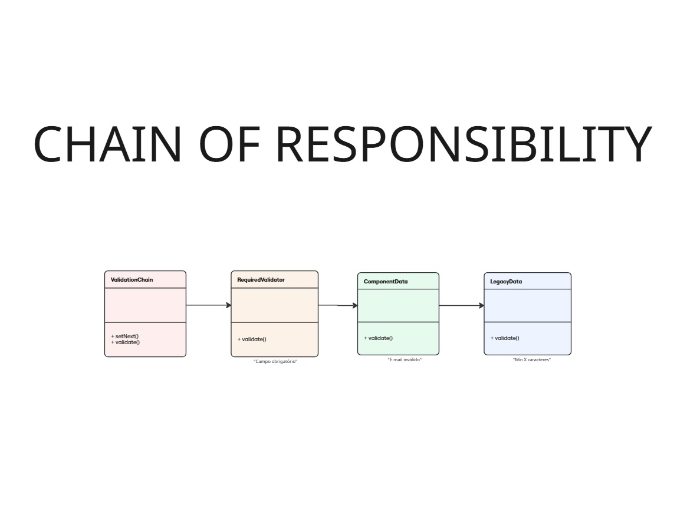

# Componente input

## Introdução

O padrão de projeto **Chain of Responsibility** é um padrão comportamental que permite processar uma solicitação por meio de uma cadeia de handlers, onde cada handler pode tratar (ou não) a solicitação e repassá-la para o próximo da cadeia. No contexto do componente input, utilizamos esse padrão para estruturar a validação dos dados do campo: cada função de validação (por exemplo, obrigatoriedade, formato de e-mail, tamanho mínimo) é um handler independente, que verifica a entrada e, caso não detecte erro, passa a responsabilidade para o próximo handler.

Essa abordagem torna a validação do input altamente flexível e extensível. Novas regras podem ser adicionadas ou removidas facilmente, sem modificar o fluxo principal do componente. Assim, garantimos um código desacoplado, de fácil manutenção e alinhado aos princípios de responsabilidade única.

## Modelagem



<font size="3"><p style="text-align: center"><b>Figura 1: </b>Modelagem do Chain of responsability aplicado ao componente input.</p></font>

## Código

Segue abaixo o código demonstrando a implementação funcional do Chain of Responsibility:

```jsx
// Handlers de validação
const requiredHandler = (value) => {
  if (!value || value.trim() === "") return "Campo obrigatório";
  return null;
};

const emailHandler = (value) => {
  if (value && !/^[^\s@]+@[^\s@]+\.[^\s@]+$/.test(value)) return "E-mail inválido";
  return null;
};

const minLengthHandler = (min) => (value) => {
  if (value && value.length  {
  const newValue = e.target.value;
  setValue(newValue);

  // Aplicando Chain of Responsibility para validação
  const validators = [requiredHandler, emailHandler];
  const errorMsg = runValidationChain(validators, newValue);
  
  if (errorMsg) {
    setEstado(estados.ERROR);
    setSupportText(errorMsg);
  } else {
    setEstado(newValue.length > 0 ? estados.FILLED : estados.DEFAULT);
    setSupportText("Texto de suporte");
  }
};
```

## Bibliografia

> GAMMA, Erich et al. Chain of Responsibility – Padrões de Projeto. Refactoring Guru. Disponível em: https://refactoring.guru/pt-br/design-patterns/chain-of-responsibility. Acesso em: 31 maio 2025.


## Histórico de Versão


<div align="center">
    <table>
        <tr>
            <th>Data</th>
            <th>Versão</th>
            <th>Descrição</th>
            <th>Autor</th>
            <th>Data da Revisão</th>
            <th>Descrição da revisão</th>
            <th>Revisor</th>
        </tr>
        <tr>
            <td>06/02/2025</td>
            <td>1.0</td>
            <td>Criação do documento</td>
            <td><a href="https://github.com/GabrielSMonteiro">Gabriel Monteiro</a></td>
            <td></td>
            <td></td>
            <td><a href="https://github.com/"></a></td>
        </tr>
    </table>
</div>