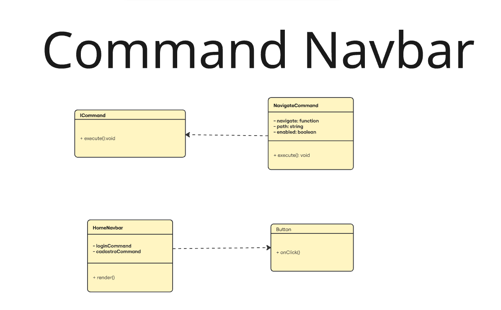
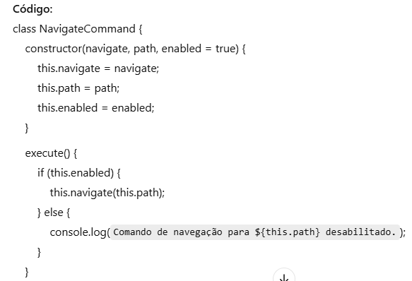
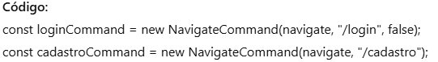

## Command

### Introdução 
O padrão Command encapsula uma solicitação como um objeto, permitindo parametrizar ações, enfileirar comandos e desfazer operações. Ele desacopla quem emite a ação de quem a executa, promovendo flexibilidade, reutilização e controle sobre as execuções. É útil quando se deseja tratar ações como objetos independentes e manipuláveis.

### Modelagem 

### Código 
Segue abaixo o código demonstrando a implementação do Command

- Encapsula a lógica de navegação como um objeto reutilizável.  

- O componente cria os comandos e define o destino da navegação.  

- Elementos da interface chamam execute() ao serem clicados.  

    <table>
        <tr>
            <th>Data</th>
            <th>Versão</th>
            <th>Descrição</th>
            <th>Autor</th>
            <th>Data da Revisão</th>
            <th>Revisor</th>
            <th>Descrição de Revisão</th>
        </tr>
        <tr>
            <td>02/06/2025</td>
            <td>1.0</td>
            <td>Acrescentando diagrama</td>
            <td><a href="https://github.com/daniela.alarcao">Daniela Alarcão</a></td>
            <td>02/06/2025</td>
            <td></td>
            <td>Criação de página + conteúdo</td>
        </tr>
    </table>

