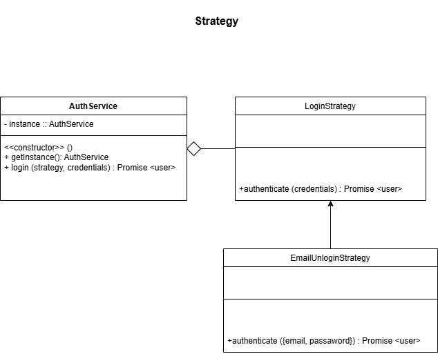
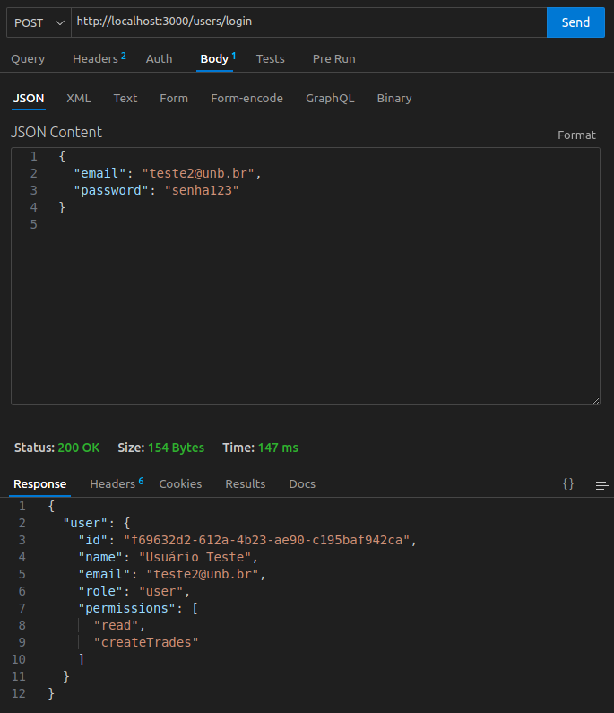
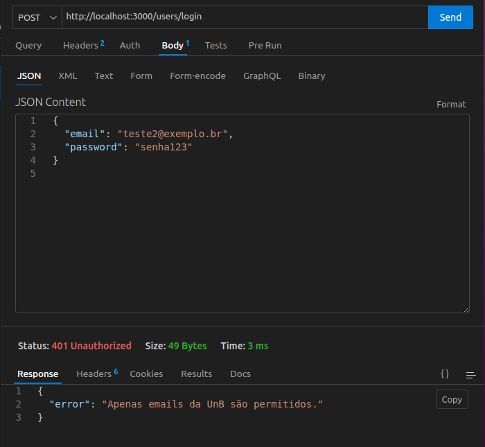

# Introdução ao Padrão Strategy

O padrão de projeto Strategy é um padrão comportamental que permite a definição de uma família de algoritmos, encapsulando cada um deles e tornando-os intercambiáveis. O Strategy permite que o algoritmo varie independentemente dos clientes que o utilizam. Este padrão é útil para situações onde é necessário escolher entre diferentes algoritmos em tempo de execução.

Neste documento, exploraremos a aplicação do padrão Strategy no contexto de um sistema backend, demonstrando como ele pode ser utilizado para melhorar a flexibilidade e a manutenibilidade do código.

## Por que usamos o Strategy?
No nosso projeto, aplicamos o padrão Strategy para tornar o sistema de autenticação flexível e extensível. Utilizamos a classe abstrata LoginStrategy para definir a interface padrão de autenticação, e implementamos EmailUnbLoginStrategy como uma estratégia concreta que valida usuários com email institucional da UnB.

Dessa forma, caso novas regras de autenticação sejam exigidas futuramente (como login via redes sociais ou autenticação com dois fatores), poderemos implementá-las como novas estratégias, sem modificar o código existente.

## Como implementamos?
Criamos uma classe base abstrata, LoginStrategy, que define o método authenticate() como obrigatório; Criamos uma classe concreta chamada EmailUnbLoginStrategy, que implementa o método authenticate() com regras específicas: O email precisa terminar com unb.br e o email e a senha são validados com base nos dados armazenados no banco. Por fim, A senha é verificada usando bcrypt.

## Implementação



<p align="center"><em>Autores(as): <a href="https://github.com/RenataKurzawa">Renata Quadros</a> e <a href="https://github.com/erteduarda">Eduarda Tavares</a>, 2025.</em></p>

O diagrama acima representa a aplicação do padrão Strategy no sistema de autenticação:

- AuthService: Contém a operação login(strategy, credentials), que recebe qualquer estratégia de login implementada.

- A associação com LoginStrategy é uma composição, pois depende de uma instância dessa estratégia para funcionar corretamente.

- LoginStrategy: Define a interface genérica para estratégias de autenticação, com o método authenticate(credentials): Promise < user >.

- EmailUnbLoginStrategy: É uma implementação concreta da interface LoginStrategy.

- Implementa o método authenticate({ email, password }) com regras específicas, como validação de domínio do e-mail da UnB.

Essa modelagem permite que o AuthService utilize diferentes lógicas de autenticação sem precisar conhecer os detalhes de cada uma. Para isso, basta fornecer a estratégia desejada no momento do login

## Código com o padrão Strategy
## login.strategy
```javascript
class LoginStrategy {
    async authenticate(credentials) {
        throw new Error('Método authenticate() deve ser implementado pela subclasse');
    }
}

module.exports = LoginStrategy;
```

## emailUnbLogin.strategy
```javascript
const { User } = require('../models');
const bcrypt = require('bcrypt');

class EmailUnbLoginStrategy {
    async authenticate({ email, password }) {
        if (!email.endsWith('unb.br')) {
            throw new Error('Apenas emails da UnB são permitidos.');
        }

        const user = await User.findOne({ where: { email } });
        if (!user || !(await bcrypt.compare(password, user.password))) {
            throw new Error('Email ou senha inválidos.');
        }

        return user;
    }
}

module.exports = EmailUnbLoginStrategy;
```

## Funcionalidade

A funcionalidade do padrão Strategy no backend pode ser exemplificada através de um sistema de autenticação que suporta múltiplos métodos de login, como email, redes sociais, ou autenticação de dois fatores. Cada método de autenticação pode ser implementado como uma estratégia separada, permitindo que o sistema escolha dinamicamente o método apropriado com base nas preferências do usuário ou nas políticas de segurança.







<p align="center"><em>Autores(as): <a href="https://github.com/RenataKurzawa">Renata Quadros</a> e <a href="https://github.com/erteduarda">Eduarda Tavares</a>, 2025.</em></p>


Embora o padrão Strategy não seja visível diretamente na resposta da requisição, sabemos que ele está funcionando corretamente porque o e-mail foi validado conforme a regra da estratégia (precisa terminar com unb.br); a senha foi comparada com segurança utilizando bcrypt; o login só é bem-sucedido se ambas as condições forem atendidas. Essas regras estão implementadas exclusivamente dentro da EmailUnbLoginStrategy, comprovando que ela foi aplicada corretamente na autenticação.

O teste funcional do padrão Strategy ocorre no mesmo endpoint /login utilizado pelo AuthService, mas aqui validamos especificamente o comportamento da estratégia EmailUnbLoginStrategy, testando: se apenas e-mails terminados com unb.br são aceitos, se a autenticação falha para senhas incorretas e se a resposta correta é retornada para usuários válidos.

## Bibliografia

> GAMMA, Erich et al. Design Patterns: Elements of Reusable Object-Oriented Software. Addison-Wesley, 1994.

> SOFTPLAN. Descomplicando o Strategy. Softplan – Tech Writers. Disponível em: https://www.softplan.com.br/tech-writers/descomplicando-o-strategy/. Acesso em: 31 maio 2025.

## Histórico de Versão

<div align="center">
    <table>
        <tr>
            <th>Data</th>
            <th>Versão</th>
            <th>Descrição</th>
            <th>Autor</th>
            <th>Data da Revisão</th>
            <th>Descrição da revisão</th>
            <th>Revisor</th>
        </tr>
        <tr>
            <td>02/06/2025</td>
            <td>1.0</td>
            <td>Adicionando introdução, modelagem, funcionalidade, bibliografia e histórico de versão</td>
            <td><a href="https://github.com/erteduarda">Eduarda Tavates</a> e <a href="https://github.com/RenataKurzawa">Renata Kurzawa</a></td>
            <td>02/06/2025</td>
            <td>revisando imagens e textos</td>
            <td><a href="https://github.com/Jagaima">Davi</a></td>
        </tr>
        <tr>
            <td>02/06/2025</td>
            <td>1.1</td>
            <td>Adicionando explicações, código e teste</td>
            <td><a href="https://github.com/erteduarda">Eduarda Tavates</a> e <a href="https://github.com/RenataKurzawa">Renata Kurzawa</a></td>
            <td>02/06/2025</td>
            <td>revisando imagens e textos</td>
            <td><a href="https://github.com/Jagaima">Davi</a></td>
        </tr>
    </table>
</div>