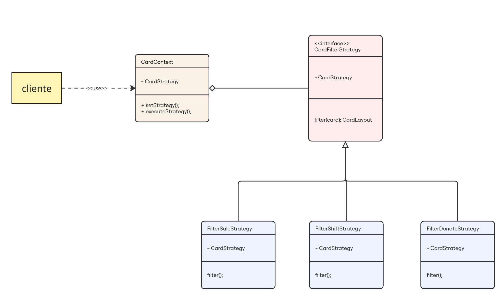

# Filtro de Anúncios

## Introdução

O padrão de projeto Strategy permite com que se faça uso de algoritimos que variem dependendo do tipo de requisição de um cliente. Isso ajuda na manuntenabilidade do código por organizar o código de maneira coesa e objetiva.

Em vista disso, esse padrão de projeto foi utilizado nesta sessão com o objetivo alterar a lógica de filtro de cards em tempo de execução para facilitar a experiência do usuário e a manutenibilidade do código. Nesse sentido, a exibição dependerá da ação do usuário, o qual poderá selecionar entre os tipos de cards `venda, troca ou doação`.

Assim, com o objetivo de manter a padronização do tipo de paradigma a ser inserido no projeto desenvolvido pela aquipe, foi optado por fazer uma adaptação do tipo orientado ao objeto para o funcional.

## Modelagem

<b>Figura 1: </b>Modelagem do Padrão de projeto Strategy aplicado aos filtros dos cards da aplicação.

## Código

Segue abaixo o código demonstrando a implementação do padrão Strategy, porém adaptado para o paradigma funcional:

### Função Contexto

Usada para determinar qual componente será renderizado.

#### `useCardStrategy`

    export const useCardStrategy = () => {
    const renderCard = (type, props) => {
        const strategy = getCardStrategy(type);
        return strategy(props);
    };

    return { renderCard };
    };

 
 

### Objeto de seleção

Mapeia o tipo `(venda, troca, doacao)` para a função estratégica correspondente.

#### `cardStrategies`

    export const cardStrategies = {
    venda: vendaCardStrategy,
    troca: trocaCardStrategy,
    doacao: doacaoCardStrategy,
    };

 
 

### Função para selecionar a estratégia

Retorna uma estratégia válida ou uma default.

#### `getCardStrategy`

    export const getCardStrategy = (type) => {
    const strategy = cardStrategies[type];
    if (!strategy) {
        console.warn(`Estratégia para o tipo '${type}' não encontrada. Usando estratégia padrão.`);
        return cardStrategies.venda; // Estratégia padrão
    }
    return strategy;
    };

 
 

### Funções Concretas

As funções a seguir tem o objetivo de retonar a criação de um componente react, podendo variar entre `CardPrimary, CardSecundary e CardTerciary`.

#### `vendaCardStrategy`

    export function vendaCardStrategy(props) {
    return React.createElement(CardPrimary, props);
    }

 
 

#### `trocaCardStrategy`

    export function trocaCardStrategy(props) {
    return React.createElement(CardSecundary, props);
    }

 
 

#### `doacaoCardStrategy`

    export function doacaoCardStrategy(props) {
    return React.createElement(CardTerciary, props);
    }

 
 

## Bibliografia

> GAMMA, Erich et al. Factory Method – Padrões de Projeto. Refactoring Guru. Disponível em: https://refactoring.guru/pt-br/design-patterns/factory-method. Acesso em: 31 maio 2025.

> SOFTPLAN. Descomplicando o Strategy. Softplan – Tech Writers. Disponível em: https://www.softplan.com.br/tech-writers/descomplicando-o-strategy/. Acesso em: 31 maio 2025.

## Histórico de Versão

    <table>
        <tr>
            <th>Data</th>
            <th>Versão</th>
            <th>Descrição</th>
            <th>Autor</th>
            <th>Data da Revisão</th>
            <th>Descrição da revisão</th>
            <th>Revisor</th>
        </tr>
        <tr>
            <td>02/06/2025</td>
            <td>1.0</td>
            <td>Adicionando o porque usar o padrão, os códigos e imagem</td>
            <td><a href="https://github.com/Marianannn">Mariana Letícia</a> e <a href="https://github.com/ccarla">Carla A C Ribeiro</a></td>
            <td>00/00/0000</td>
            <td></td>
            <td><a href="https://github.com/SEU_GIT]">SEU_NOME</a></td>
        </tr>
    </table>

