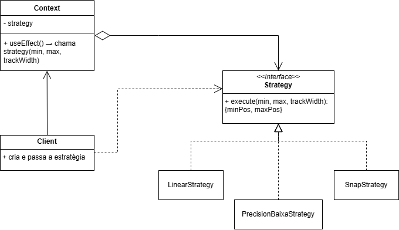

# Range

## Introdução

O componente RangeDePreco é um controle deslizante de faixa de preço que permite aos usuários selecionar valores mínimos e máximos. Ele oferece três estratégias diferentes de mapeamento de valores para posições na trilha:

- Estratégia Linear Padrão: Distribuição uniforme dos valores ao longo da trilha 200

- Estratégia de Precisão Baixa: Maior precisão para valores baixos (0-100)

- Estratégia com Snap: Ajusta os valores para faixas pré-definidas
 

## Modelagem

<b>Figura 1: </b>Modelagem do Padrão de projeto Strategy aplicado ao componente range.

 

## Código

Segue abaixo o código demonstrando a implementação do padrão Strategy, porém adaptado para o paradigma funcional:

### Estratégias Disponíveis

#### `linearStrategy` (Padrão)

    export const linearStrategy = (min, max, trackWidth) => ({
      minPos: (min / 200) * trackWidth,
      maxPos: (max / 200) * trackWidth
    });

 

#### `precisionBaixaStrategy` (Precisão em valores baixos)

    export const precisionBaixaStrategy = (min, max, trackWidth) => {
    const scale = (value) => {
      if (value <= 100) {
        return (value / 100) * trackWidth;
      } else {
        return trackWidth;
      }
    };
  
    return {
      minPos: scale(min),
      maxPos: scale(max)
    };
  };

 

#### `createSnapStrategy` (Estratégia com snap)

    export const createSnapStrategy = (steps = [0, 50, 100, 150, 200]) => {
    const findClosest = (value) =>
      steps.reduce((prev, curr) =>
        Math.abs(curr - value) < Math.abs(prev - value) ? curr : prev
      );
  
    const strategyFn = (min, max, trackWidth) => ({
      minPos: (findClosest(min) / 200) * trackWidth,
      maxPos: (findClosest(max) / 200) * trackWidth
    });
  
    strategyFn.snap = true;
    strategyFn.steps = steps;
  
    return strategyFn;
  };

 

### Componente Principal

#### `RangeDePreco`

    export const createSnapStrategy = (steps = [0, 50, 100, 150, 200]) => {
      const findClosest = (value) =>
        steps.reduce((prev, curr) =>
          Math.abs(curr - value) < Math.abs(prev - value) ? curr : prev
        );
    
      const strategyFn = (min, max, trackWidth) => ({
        minPos: (findClosest(min) / 200) * trackWidth,
        maxPos: (findClosest(max) / 200) * trackWidth
      });
    
      strategyFn.snap = true;
      strategyFn.steps = steps;
    
      return strategyFn;
    };

 

### Vantagens

- Flexibilidade: Pode-se trocar a estratégia em tempo de execução

- Extensibilidade: Fácil adição de novas estratégias sem modificar o componente principal

- Manutenibilidade: Cada estratégia é isolada e independente

- Reusabilidade: As estratégias podem ser usadas em outros componentes

 

## Bibliografia

> GAMMA, Erich et al. Factory Method – Padrões de Projeto. Refactoring Guru. Disponível em: https://refactoring.guru/pt-br/design-patterns/factory-method. Acesso em: 31 maio 2025.

> SOFTPLAN. Descomplicando o Strategy. Softplan – Tech Writers. Disponível em: https://www.softplan.com.br/tech-writers/descomplicando-o-strategy/. Acesso em: 31 maio 2025.

 

## Histórico de Versão

    <table>
        <tr>
            <th>Data</th>
            <th>Versão</th>
            <th>Descrição</th>
            <th>Autor</th>
            <th>Data da Revisão</th>
            <th>Descrição da revisão</th>
            <th>Revisor</th>
        </tr>
        <tr>
            <td>02/06/2025</td>
            <td>1.0</td>
            <td>Adicionando artefato do range com strategy</td>
            <td><a href="https://github.com/Karolina91">Karolina Vieira</a> e <a href="https://github.com/paolaalim">Paola Nascimento</a></td>
            <td>00/00/0000</td>
            <td></td>
            <td><a href="https://github.com/SEU_GIT]">SEU_NOME</a></td>
        </tr>
    </table>

