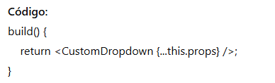

## Builder

### Introdução
O padrão Builder é um padrão criacional que tem como objetivo separar a construção de um objeto da sua representação, permitindo criar diferentes variações do mesmo passo a passo, de forma clara, fluente e flexível. Ele é útil quando há muitos parâmetros opcionais ou combinações possíveis, evitando construtores sobrecarregados e facilitando a montagem personalizada de objetos.

### Modelagem 

### Código 
Segue abaixo o código demonstrando a implementação do Builder

- A classe DropdownBuilder facilita a construção de um dropdown com várias opções de configuração encadeadas.  

- Cada método setOptions() configura uma propriedade e retorna o próprio builder para encadeamento.

- O método build() monta e retorna o componente CustomDropdown com todas as configurações feitas.

    <table>
        <tr>
            <th>Data</th>
            <th>Versão</th>
            <th>Descrição</th>
            <th>Autor</th>
            <th>Data da Revisão</th>
            <th>Revisor</th>
            <th>Descrição de Revisão</th>
        </tr>
        <tr>
            <td>02/06/2025</td>
            <td>1.0</td>
            <td>Acrescentando diagrama</td>
            <td><a href="https://github.com/daniela.alarcao">Daniela Alarcão</a></td>
            <td>02/06/2025</td>
            <td></td>
            <td>Criação de página + conteúdo</td>
        </tr>
    </table>

