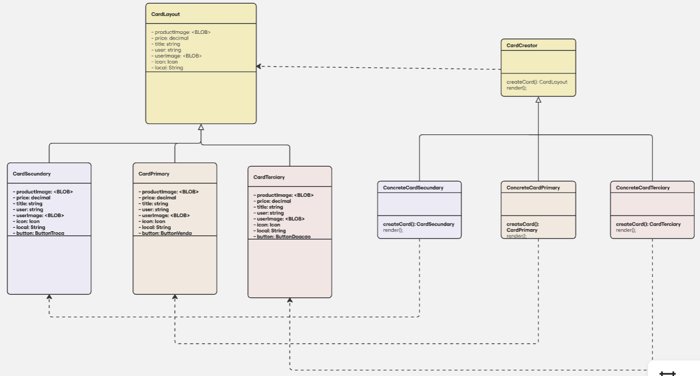

# Componente Card de Anúncios

## Introdução

O padrão de projeto Factory Method é um padrão que possibilita uma alta escalabilidade no gerenciamento de criação de instâncias de um projeto. Nesse sentido, pensando no Front-End, dada a possibilidade de modificar e evoluir uma aplicação, foi utilizado o Factory Method como forma de dinamizar a renderização de cards de vários tipos.

Sendo assim, foi pensado que, por termos 3 tipos diferentes de operações que os usuários podem fazer no contexto principal do nosso projeto `(venda, troca e doação)`, entendemos que poderia ser uma boa possibilidade para a aplicação do Factory Method. Sendo assim, no Front-End criamos componentes para cada um dos tipos de cards que poderíamos obter `(troca, venda e doação)`, e permitimos que ao renderizar os elementos, apenas obtendo o valor `type`, este seria passado para o factory o qual faria o gerenciamento do tipo de card a ser renderizado. 

## Modelagem

<b>Figura 1: </b>Modelagem do Factory Method aplicado aos cards da aplicação.

## Código

Segue abaixo o código demonstrando a implementação do FactoryMethod:

### Classe Abstrata

A classe `CardCreator` tem o objetivo de fornecer o mesmo método à suas subclasses correspondentes.

#### `CardCreator`

    class CardCreator extends React.Component {
    createCard() {
        throw new Error("Subclasse precisa implementar createCard()");
    }

    render() {
        return this.createCard();
    }
    }

    export default CardCreator;

 
 

### Sublasses Concretas

As substrasses concretas possuem o objetivo de gerar componentes de seus respectivos tipos. Portanto, por exemplo, a subclasse `CardPrimaryConcrete` irá importar e retornar o componente `CardPrimary` e o mesmo ocorre com as outras subclasses a seguir.

#### `CardPrimaryConcrete`

    class CardPrimaryConcrete extends CardCreator{
        
        createCard(props) {
            return <CardPrimary {...props}/>;
        }
    }

    export default CardPrimaryConcrete;

 
 

#### `CardSecundaryConcrete`

    class CardSecundaryConcrete extends CardCreator {
        createCard(props) {
            return <CardSecundary {...props}/>;
        }
    }

    export default CardSecundaryConcrete;

 
 

#### `CardTerciaryConcrete`

    class CardTerciaryConcrete extends CardCreator {
        createCard(props) {
            return <CardTerciary {...props}/>;
        }
    }

    export default CardTerciaryConcrete;

 
 

### Fábrica

A fábrica `CardFactory` tem como objetivo guardar a lógica de criação de cards dentro de si. Logo, dependendo da variável a ser recebida, ele irá chamar uma subclasse concreta a qual irá renderizar seu respectivo componente.

#### `CardFactory`

    export class CardFactory {
    
        static create(type, props) {
            let card;
            switch (type) {
                case 'venda':
                    card = new CardPrimaryConcrete();
                    break;
                case 'troca':
                    card = new CardSecundaryConcrete();
                    break;
                case 'doacao':
                    card = new CardTerciaryConcrete();
                    break;
                default:
                    return null;
            }
            return card.createCard(props);
        }
    }
    export default CardFactory;

## Bibliografia

> GAMMA, Erich et al. Factory Method – Padrões de Projeto. Refactoring Guru. Disponível em: https://refactoring.guru/pt-br/design-patterns/factory-method. Acesso em: 31 maio 2025.

## Histórico de Versão

    <table>
        <tr>
            <th>Data</th>
            <th>Versão</th>
            <th>Descrição</th>
            <th>Autor</th>
            <th>Data da Revisão</th>
            <th>Descrição da revisão</th>
            <th>Revisor</th>
        </tr>
        <tr>
            <td>01/06/2025</td>
            <td>1.0</td>
            <td>Adicionando o porque usar o padrão, os códigos e imagem</td>
            <td><a href="https://github.com/Marianannn">Mariana Letícia</a> e <a href="https://github.com/ccarla">Carla A C Ribeiro</a></td>
            <td>00/00/0000</td>
            <td></td>
            <td><a href="https://github.com/SEU_GIT]">SEU_NOME</a></td>
        </tr>
    </table>

