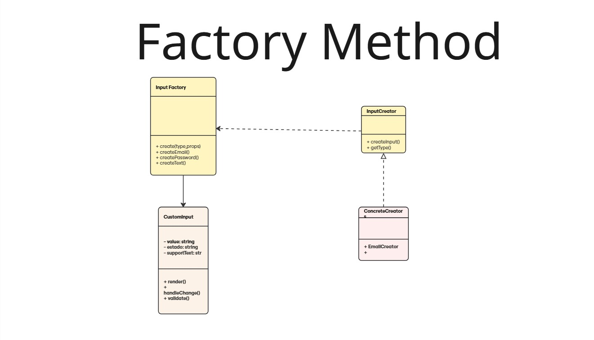
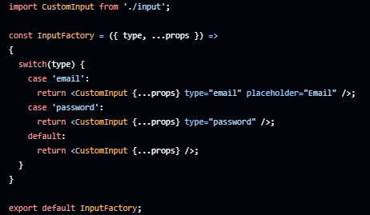

# Componente input

## Introdução

O padrão de projeto **Factory Method** é um dos principais padrões criacionais e tem como objetivo centralizar e flexibilizar a criação de objetos, desacoplando o processo de instanciamento do restante da aplicação. No contexto do input, foi utilizado o Factory Method para facilitar a criação de diferentes variações do input (como email, senha ou texto simples) a partir de uma única interface de fábrica.

Essa abordagem permite que a lógica de construção de cada tipo de input fique isolada e facilmente extensível: se precisarmos adicionar um novo tipo de campo ou alterar o comportamento de um já existente, basta modificar ou criar um novo método de fábrica, sem a necessidade de alterar o código do componente principal. Isso garante maior escalabilidade, manutenção centralizada e evita duplicação de código, além de tornar o sistema mais preparado para evoluções futuras.

## Modelagem

<b>Figura 1: </b>Modelagem do Factory Method aplicado ao componente input.

## Código

Segue abaixo o código demonstrando a implementação do FactoryMethod:

## Bibliografia

> GAMMA, Erich et al. Factory Method – Padrões de Projeto. Refactoring Guru. Disponível em: https://refactoring.guru/pt-br/design-patterns/factory-method. Acesso em: 31 maio 2025.

## Histórico de Versão

    <table>
        <tr>
            <th>Data</th>
            <th>Versão</th>
            <th>Descrição</th>
            <th>Autor</th>
            <th>Data da Revisão</th>
            <th>Descrição da revisão</th>
            <th>Revisor</th>
        </tr>
        <tr>
            <td>06/02/2025</td>
            <td>1.0</td>
            <td>Criação do documento</td>
            <td><a href="https://github.com/GabrielSMonteiro">Gabriel Monteiro</a></td>
            <td></td>
            <td></td>
            <td></td>
        </tr>
    </table>

