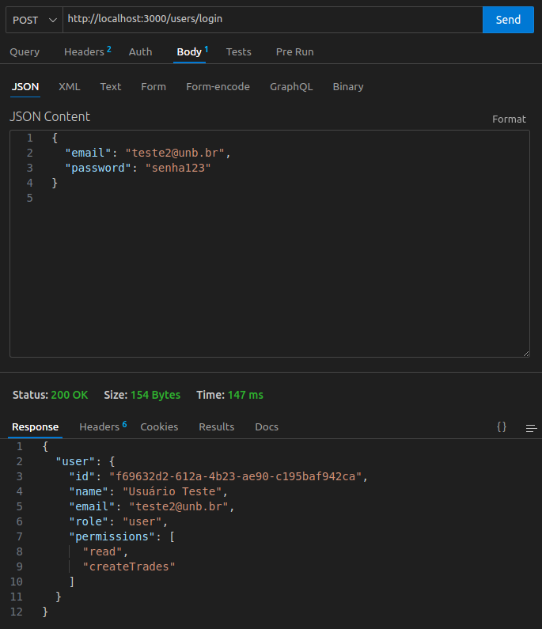

# Introdução ao Padrão Singleton

O padrão de projeto Singleton, definido no catálogo GoF (Gang of Four), tem como principal objetivo garantir que uma classe tenha apenas uma única instância e fornecer um ponto de acesso global a ela. Esse padrão é comumente utilizado em situações em que um único objeto é suficiente para coordenar ações em todo o sistema, como no caso de serviços de autenticação, configuração, logs ou gerenciamento de conexões com banco de dados.

## Por que usamos o Singleton?

No nosso projeto, optamos por utilizar o Singleton no serviço de autenticação (AuthService) para garantir que exista apenas uma instância do serviço de login durante toda a execução da aplicação. Isso evita a criação desnecessária de múltiplos objetos que executam a mesma lógica e ainda proporciona um ponto centralizado para gerenciar a autenticação de usuários, o que melhora a eficiência e a organização do código.

## Como implementamos?

No nosso código, a função createAuthService() define o serviço de autenticação, contendo um método login() que recebe uma strategy (padrão Strategy) e as credentials, e retorna o resultado da autenticação.

Usamos uma variável fora do escopo chamada authServiceInstance para armazenar a instância única. A função getAuthService() é responsável por verificar se essa instância já foi criada. Se ainda não existir, ela a cria usando createAuthService(). Caso contrário, apenas retorna a instância existente.

## Implementação 


<p align="center"><em>Autores(as): <a href="https://github.com/RenataKurzawa">Renata Quadros</a> e <a href="https://github.com/erteduarda">Eduarda Tavares</a>, 2025.</em></p>


O diagrama acima representa a estrutura do padrão Singleton para o AuthService. Ele está dividido da seguinte forma:

- AuthService: é a classe que queremos instanciar apenas uma vez.

- instance: AuthService: atributo privado estático que armazena a instância única.

- << constructor >>(): representa o construtor da classe, geralmente privado ou controlado para evitar múltiplas instâncias.

+ getInstance(): AuthService: método público que retorna a instância única. Ele verifica se a instância já existe e a cria se necessário.

+ login(strategy, credentials): Promise < user >: método responsável por autenticar o usuário, usando uma estratégia definida externamente (comportamento do padrão Strategy).

Esse modelo ajuda a padronizar o acesso ao serviço de login e mantém o sistema mais previsível, modular e fácil de manter.


## Código com o padrão Singleton
```javascript
const bcrypt = require('bcrypt');
const { User } = require('../models');

class AuthService {
    static instance;

    static getInstance() {
        if (!AuthService.instance) {
            AuthService.instance = new AuthService();
        }
        return AuthService.instance;
    }

    async login(strategy, credentials) {
        return strategy.authenticate(credentials);
    }
}

module.exports = AuthService;
``` 
<p align="center"><em>Autores(as): <a href="https://github.com/RenataKurzawa">Renata Quadros</a> e <a href="https://github.com/erteduarda">Eduarda Tavares</a>, 2025.</em></p>

## Funcionalidade

A funcionalidade do padrão Singleton no backend se baseia em garantir que apenas uma instância de um determinado serviço seja criada e utilizada em toda a aplicação. Um exemplo comum é um gerenciador de configurações que carrega os dados uma única vez e os disponibiliza globalmente, evitando retrabalho e inconsistências.

No nosso projeto, aplicamos o Singleton para o serviço de autenticação (AuthService), garantindo que todas as partes do sistema compartilhem a mesma instância responsável por autenticar usuários. Isso simplifica o controle de acesso, melhora o desempenho e evita múltiplas inicializações desnecessárias do serviço.




<p align="center"><em>Autores(as): <a href="https://github.com/RenataKurzawa">Renata Quadros</a> e <a href="https://github.com/erteduarda">Eduarda Tavares</a>, 2025.</em></p>

Para validar o funcionamento do padrão Singleton, realizamos múltiplas requisições ao endpoint de login usando o Postman.

Apesar de o padrão Singleton não ser visível diretamente na resposta da requisição, sabemos que ele está funcionando corretamente porque a função getInstance(), responsável por criar a instância do serviço de autenticação (AuthService), é chamada apenas uma vez durante a execução da aplicação. Isso garante que todas as requisições utilizam a mesma instância do serviço, como esperado no padrão.

## Bibliografia

> GAMMA, Erich et al. Design Patterns: Elements of Reusable Object-Oriented Software. Addison-Wesley, 1994.

> SOFTPLAN. Descomplicando o Singleton. Softplan – Tech Writers. Disponível em: https://www.softplan.com.br/tech-writers/descomplicando-o-singleton/. Acesso em: 31 maio 2025.

## Histórico de Versão

<div align="center">
    <table>
        <tr>
            <th>Data</th>
            <th>Versão</th>
            <th>Descrição</th>
            <th>Autor</th>
            <th>Data da Revisão</th>
            <th>Descrição da revisão</th>
            <th>Revisor</th>
        </tr>
        <tr>
            <td>02/06/2025</td>
            <td>1.0</td>
            <td>Adicionando introdução, modelagem, funcionalidade, bibliografia e histórico de versão</td>
            <td><a href="https://github.com/erteduarda">Eduarda Tavates</a> e <a href="https://github.com/RenataKurzawa">Renata Kurzawa</a></td>
            <td>02/06/2025</td>
            <td>revisando imagens e textos</td>
            <td><a href="https://github.com/Jagaima">Davi</a></td>
        </tr>
        <tr>
            <td>02/06/2025</td>
            <td>1.1</td>
            <td>Adicionando explicações, código e teste</td>
            <td><a href="https://github.com/erteduarda">Eduarda Tavates</a> e <a href="https://github.com/RenataKurzawa">Renata Kurzawa</a></td>
            <td>02/06/2025</td>
            <td>revisando imagens e textos</td>
            <td><a href="https://github.com/Jagaima">Davi</a></td>
        </tr>
    </table>
</div>