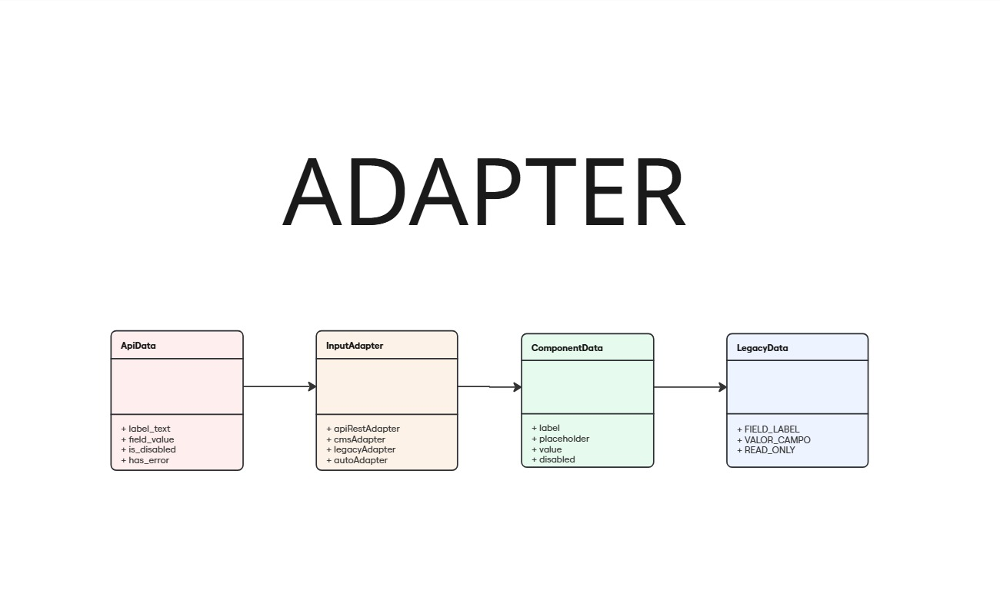

# Componente input

## Introdução

O padrão de projeto **Adapter** é um padrão estrutural que permite a colaboração entre objetos com interfaces incompatíveis, atuando como um tradutor entre diferentes formatos de dados. No contexto do componente de input, utilizou  o Adapter para converter dados provenientes de diferentes fontes para um formato padronizado que o componente possa consumir.

Esta abordagem garante que o componente de input permaneça desacoplado das especificidades de cada fonte de dados, permitindo que ele funcione com qualquer formato de entrada desde que exista um adaptador apropriado. Isso significa que se uma API mudar sua estrutura de resposta ou se precisarmos integrar com um novo sistema, basta criar ou ajustar o adaptador correspondente, sem necessidade de modificar o componente principal.

O padrão Adapter promove maior flexibilidade, reutilização de código e facilita a manutenção, especialmente em aplicações que precisam integrar dados de múltiplas fontes com formatos distintos, tornando o sistema mais robusto e preparado para evoluções futuras.

## Modelagem



<font size="3"><p style="text-align: center"><b>Figura 1: </b>Modelagem do Factory Method aplicado ao componente input.</p></font>

## Código

Segue abaixo o código demonstrando a implementação do Adapter:

```jsx
export const jsonSchemaAdapter = (schemaField) => ({
  label: schemaField.title || schemaField.name || "Label",
  placeholder: schemaField.examples?.[0] || schemaField.description || "Digite aqui",
  value: schemaField.default || "",
  disabled: schemaField.readOnly || false,
  error: false,
  supportText: schemaField.description || "Texto de suporte",
  type: schemaField.format === "email" ? "email" : 
        schemaField.format === "password" ? "password" : "text",
  required: schemaField.required || false,
  minLength: schemaField.minLength,
  maxLength: schemaField.maxLength
});
```

## Bibliografia

> GAMMA, Erich et al. Adapter – Padrões de Projeto. Refactoring Guru. Disponível em: https://refactoring.guru/pt-br/design-patterns/adapter. Acesso em: 31 maio 2025.


## Histórico de Versão


<div align="center">
    <table>
        <tr>
            <th>Data</th>
            <th>Versão</th>
            <th>Descrição</th>
            <th>Autor</th>
            <th>Data da Revisão</th>
            <th>Descrição da revisão</th>
            <th>Revisor</th>
        </tr>
        <tr>
            <td>06/02/2025</td>
            <td>1.0</td>
            <td>Criação do documento</td>
            <td><a href="https://github.com/GabrielSMonteiro">Gabriel Monteiro</a></td>
            <td></td>
            <td></td>
            <td><a href="https://github.com/"></a></td>
        </tr>
    </table>
</div>