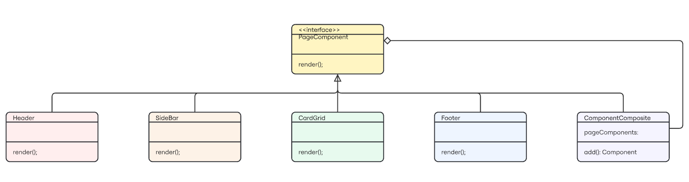

# View de Anúncios

## Introdução

O padrão de projeto Composite é um padrão estrutural que permite compor objetos em estruturas de árvore para representar hierarquias parte-todo. Este padrão permite que os clientes tratem objetos individuais e composições de objetos de maneira uniforme. No contexto do front-end, o Composite é particularmente útil para construir interfaces de usuário complexas a partir de componentes mais simples.

No projeto Desapega, a página de Anúncios foi implementada seguindo o padrão Composite, onde temos uma estrutura hierárquica de componentes que formam a interface completa. A página principal (Anuncios) atua como o componente composto que contém outros componentes (Sidebar e AnunciosList), e o AnunciosList por sua vez contém múltiplos cards de anúncios que são renderizados de acordo com seu tipo.

## Modelagem



<font size="3"><p style="text-align: center"><b>Figura 1: </b>Modelagem do padrão Composite aplicado à View de Anúncios.</p></font>

## Código

Segue abaixo o código demonstrando a implementação do padrão Composite:

### Componente Base (Component)

Em React, o componente base é representado pelos componentes React que compartilham uma interface comum. No nosso caso, todos os componentes da página de anúncios são componentes React.

### Componente Composto (Composite)

O componente `Anuncios` atua como um Composite, agregando outros componentes:

```jsx
import React from "react";
import Sidebar from "./__partials__/Sidebar";
import AnunciosList from "./__partials__/AnunciosList";

const Anuncios = () => {
  return (
    <page className="w-full flex justify-center min-h-screen pb-10">
      <div className="w-[1024px] flex flex-col items-end">
        <div className="w-2/3 py-6">
          <h1 className="text-xl text-primary-800 font-semibold">Resultados para: </h1>
        </div>
        <div className="w-full flex">
          <Sidebar />
          <AnunciosList />
        </div>
      </div>
    </page>
  )
}

export default Anuncios;
```

O componente `AnunciosList` também atua como um Composite, contendo múltiplos cards de anúncios:

```jsx
const AnunciosList = () => {
    // Usa o hook personalizado que implementa o padrão Strategy
    const { renderCard } = useCardStrategy();
    
    // Função que renderiza um card para um anúncio específico
    const renderAnuncioCard = (anuncio) => {
        return renderCard(anuncio.type, {
            title: anuncio.title,
            price: anuncio.price,
            user: anuncio.user,
            local: anuncio.local
        });
    };

    return (
        <section className="w-full grid grid-cols-3 gap-4 border-l border-primary-800 pl-4">
            {anunciosData.map((anuncio) => (
                <div key={anuncio.id} className="mb-4">
                    {renderAnuncioCard(anuncio)}
                </div>
            ))}
        </section>
    );
};
```

### Componentes Folha (Leaf)

Os cards de anúncios individuais atuam como componentes folha na estrutura:

```jsx
// Exemplo de um componente folha (renderizado pelo Strategy pattern)
const VendaCard = ({ title, price, user, local }) => (
  <div className="bg-white p-4 rounded-lg shadow-md border border-primary-100">
    <h3 className="text-lg font-semibold text-primary-800">{title}</h3>
    <p className="text-primary-600 font-bold mt-2">{price}</p>
    <div className="mt-4 flex justify-between text-sm text-gray-500">
      <span>{user}</span>
      <span>{local}</span>
    </div>
    <div className="mt-3">
      <span className="bg-primary-100 text-primary-800 text-xs px-2 py-1 rounded-full">Venda</span>
    </div>
  </div>
);
```

## Benefícios da Aplicação do Padrão

1. **Organização Hierárquica**: A estrutura da interface é organizada de forma hierárquica, facilitando a compreensão e manutenção do código.

2. **Reutilização de Componentes**: Componentes como `Sidebar` e os cards de anúncios podem ser reutilizados em diferentes contextos.

3. **Flexibilidade**: Novos componentes podem ser adicionados à hierarquia sem alterar o código existente.

4. **Uniformidade**: Todos os componentes são tratados de maneira uniforme, independentemente de serem simples ou compostos.

5. **Integração com Outros Padrões**: O padrão Composite se integra bem com outros padrões, como o Strategy (usado para renderizar diferentes tipos de cards).

## Relação com Outros Padrões

No projeto Desapega, o padrão Composite é utilizado em conjunto com o padrão Strategy para a renderização de diferentes tipos de cards. Enquanto o Composite organiza a estrutura hierárquica da interface, o Strategy determina como cada tipo de card deve ser renderizado.

## Bibliografia

> GAMMA, Erich et al. Composite – Padrões de Projeto. Refactoring Guru. Disponível em: https://refactoring.guru/pt-br/design-patterns/composite. Acesso em: 02 junho 2025.

> FREEMAN, Eric; FREEMAN, Elisabeth. Use a Cabeça! Padrões de Projetos. 2ª Edição. Rio de Janeiro: Alta Books, 2009.

## Histórico de Versão

<div align="center">
    <table>
        <tr>
            <th>Data</th>
            <th>Versão</th>
            <th>Descrição</th>
            <th>Autor</th>
            <th>Data da Revisão</th>
            <th>Descrição da revisão</th>
            <th>Revisor</th>
        </tr>
        <tr>
            <td>02/06/2025</td>
            <td>1.0</td>
            <td>Criação do documento sobre o padrão Composite na View de Anúncios</td>
            <td><a href="https://github.com/Marianannn">Mariana Letícia</a> e <a href="https://github.com/ccarla">Carla A C Ribeiro</a></td>
            <td>00/00/0000</td>
            <td></td>
            <td><a href="https://github.com/SEU_GIT]">SEU_NOME</a></td>
        </tr>
    </table>
</div>
