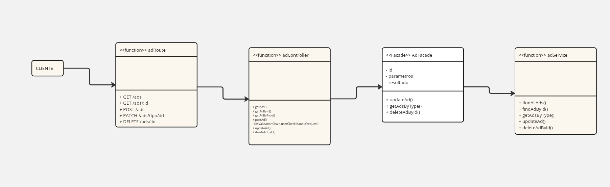

## Facade

O Facade é um padrão de projeto estrutural, definido no catálogo Gang of Four (GoF), que tem como objetivo fornecer uma interface simplificada para um conjunto mais complexo de classes, bibliotecas ou sistemas. Ele atua como uma "fachada" que esconde a complexidade interna do subsistema, expondo apenas métodos de alto nível mais fáceis de usar. Assim, o Facade promove o encapsulamento e reduz o acoplamento entre o cliente e o subsistema, facilitando a manutenção, a legibilidade e a escalabilidade do código.

## Estrutura Facade
A estrutura clássica do Facade envolve três componentes principais:


1. **Facade** (fachada): é a interface simplificada que expõe métodos de alto nível, ocultando a complexidade do subsistema.

2. **Subsistemas:** são os componentes internos e complexos que realizam as operações específicas.

3. **Cliente:** utiliza o Facade para interagir com o sistema, sem conhecer os detalhes de implementação dos subsistemas.

No contexto deste projeto, a estrutura se manifestou da seguinte forma:

**Facade:** AdFacade — fornece métodos simplificados (getAdsByType, updateAd, deleteAdById) para operações relacionadas a anúncios.

**Subsistema:** adService — implementa a lógica de persistência e manipulação direta dos anúncios no banco de dados.

**Cliente:** adController — utiliza o AdFacade para realizar operações de maneira desacoplada, facilitando a manutenção e a expansão futura.

## Porque eu decidi usar o Facade?
O uso do Facade neste projeto foi essencial para reduzir o acoplamento entre a camada de controle (adController) e a camada de serviços (adService). Sem o Facade, o controller precisaria conhecer e gerenciar diretamente múltiplos métodos e regras de negócio dispersas, o que aumentaria a complexidade e dificultaria futuras alterações.

Ao centralizar operações como a validação de tipos de anúncios (getAdsByType), verificação de dados (updateAd) e execução de remoção (deleteAdById) no AdFacade, o projeto alcança diversas vantagens:

- Encapsulamento da complexidade: a lógica adicional de verificação e processamento fica restrita ao AdFacade, evitando repetição de código e facilitando a evolução de regras de negócio.

- Facilidade de manutenção: alterações internas no adService ou em regras de negócio não impactam diretamente os controllers, desde que a interface do AdFacade seja mantida.

- Melhor legibilidade: controllers mais limpos e focados na orquestração das requisições, enquanto o AdFacade gerencia os detalhes operacionais.

- Facilidade de testes: possibilita a criação de testes unitários mais simples e focados, tanto para o AdFacade quanto para o controller, isolando responsabilidades.

Em resumo, a aplicação do padrão Facade neste projeto proporcionou uma arquitetura mais modular, flexível e escalável, alinhada com boas práticas de design de software.

## Implementação do Padrão no Projeto




## Videos explicando código que mostram o facade

### Usuários

<iframe width="1328" height="747" src="https://www.youtube.com/embed/5clXM9tl8RE" title="Apresentação do User no banco de dados" frameborder="0" allow="accelerometer; autoplay; clipboard-write; encrypted-media; gyroscope; picture-in-picture; web-share" referrerpolicy="strict-origin-when-cross-origin" allowfullscreen></iframe>


### Funcionamento das requsições

<iframe width="1328" height="747" src="https://www.youtube.com/embed/ZaWy8Xyx2Ms" title="Testes de Requisições do código - Grupo 06" frameborder="0" allow="accelerometer; autoplay; clipboard-write; encrypted-media; gyroscope; picture-in-picture; web-share" referrerpolicy="strict-origin-when-cross-origin" allowfullscreen></iframe>


## Código com o Padrão Facade 
Abaixo segue os códigos que foram montados para implementar o padrão Facade no projeto.

`<<client>> adController`
```javascript
const AdFacade = require('../facades/ad.facade');

async function updateAd(req, res, next)
{
  try
  {
    const updated_ad = await AdFacade.updateAd(req.params.id, req.body);
    res.status(200).send(updated_ad, {message: 'Anúncio editado com sucesso!'});
  }
  catch(err)
  {
    res.status(500).send({message: "❌ Erro ao tentar atualizar o anúncio ❌", error: err.message});
  }
}

async function getAdsByType(req, res, next) 
{
  try
  {
    const ads = await AdFacade.getAdsByType(req.params.type);
    res.status(200).send(ads);
  } 
  catch(err)
  {
    res.status(500).send({ message: 'Erro ao buscar anúncioas', error: err.message });
  } 
}

async function deleteAdById(req, res, next)
{
  try
  {
    await AdFacade.deleteAdById(req.params.id);
    res.status(200).send({message: '☑️ Anúncio deletado com sucesso!'});
  }
  catch(err)
  {
    res.status(500).send({message: '❌ Erro ao deletar anúncio', error: err.message});
  }
}
```

`AdFacade`
```javascript
const adService = require('../services/ad.service');

class AdFacade
{
    async getAdsByType(type)
    {
        const existing_types = ['sale', 'donation', 'exchange'];

        if(!existing_types.includes(type))
        {
            console.log("Tipo de anúncio inexistente");
            return;
        }

        return await adService.getAdsByType(type);
    }

    async updateAd(id, body)
    {
        if(!id || !body || Object.keys(body).length === 0)
        {
            return;
        }

        return await adService.updateAd(id, body);
    }

    async deleteAdById(id)
    {
        return adService.deleteAdById(id);
    }
}

module.exports = new AdFacade();
```

`<<subsystem>> adService`
```javascript
const db = require('../models');

async function getAdsByType(type) {
  try {
    const ads = await db.Ad.findAll({
      where: {
        type: type,
        isActive: true
      },
      include: [
        {
          model: db.Media,
          as: 'medias'
        },
        {
          model: db.Interest,
          as: 'interests'
        }
      ]
    });
    return ads;
  } catch (err) {
    console.error('Erro ao buscar anúncios:', err);
    throw err;
  }
}

async function updateAd(id, data) {
  const [updatedRowsCount] = await db.Ad.update(data, {
    where: { id }
  });

  if (updatedRowsCount === 0) {
    throw new Error('O anúncio não pode ser encontrado!');
  }

  return await findAdById(id);
}
```

## Explicação do código: Classe AdFacade
## Documentação da Classe `AdFacade`

### 1. Método assíncrono: `getAdsByType`

Esse é o método principal para buscar anúncios por tipo. Ele realiza as seguintes etapas:

- **Validação do Tipo:**  
Antes de realizar a busca, verifica se o `type` informado está entre os tipos válidos: `['sale', 'donation', 'exchange']`.  
Caso o tipo não seja reconhecido, exibe a mensagem no console: `"Tipo de anúncio inexistente"` e encerra a execução retornando `undefined`.

- **Busca no Serviço:**  
Se o tipo for válido, chama o método `adService.getAdsByType` para recuperar os anúncios correspondentes no banco de dados.

---

### 2. Método assíncrono: `updateAd`

Esse é o método principal para atualizar um anúncio existente. Ele executa as seguintes etapas:

- **Validação dos Parâmetros:**  
Verifica se o `id` foi informado e se o `body` contém ao menos uma propriedade para atualização.  
Caso falte algum dado ou o corpo da requisição esteja vazio, o método encerra retornando `undefined`.

- **Atualização no Serviço:**  
Se os dados forem válidos, chama `adService.updateAd` passando o `id` e o `body` para realizar a atualização no banco de dados.  
Retorna o anúncio atualizado.

---

### 3. Método assíncrono: `deleteAdById`

Esse é o método principal para remover um anúncio pelo seu ID. Ele segue as seguintes etapas:

- **Delegação para o Serviço:**  
Chama diretamente o método `adService.deleteAdById`, passando o `id` do anúncio a ser removido.  
Não realiza validações adicionais, assumindo que o `id` fornecido é válido.  
Retorna o resultado da exclusão.


## Bibliografia

> GRAN CURSOS ONLINE. Padrões de Projetos GoF: dicas de memorização e questões de concursos. Blog Gran Cursos Online, [s.d.]. Disponível em: https://blog.grancursosonline.com.br/padroes-de-projetos-gof-dicas-de-memorizacao-e-questoes-de-concursos/. Acesso em: 2 jun. 2025.


<div align="center">
    <table>
        <tr>
            <th>Data</th>
            <th>Versão</th>
            <th>Descrição</th>
            <th>Autor</th>
            <th>Data da Revisão</th>
            <th>Revisor</th>
            <th>Descrição de Revisão</th>
        </tr>
        <tr>
            <td>02/06/2025</td>
            <td>1.0</td>
            <td>Acrescentando diagrama explicações feitas por Arthur e Davi</td>
            <td><a href="https://github.com/arthur-suares">Arthur Suares</a> e <a href="https://github.com/Jagaima">Davi Nobre</a></td>
            <td>02/06/2025</td>
            <td><a href="https://github.com/Jagaima">Davi Nobre</a></td>
            <td>Foi revisado o diagrama de classes da dupla que faço parte, seu posicionamento no documento e se era possível acessa-lo</td>
        </tr>
        <tr>
            <td>02/06/2025</td>
            <td>1.1</td>
            <td>Acrescentando videos comprobatórios</td>
            <td><a href="https://github.com/Jagaima" >Davi Nobre</a> e <a href="https://github.com/arthur-suares">Arthur Suares</a></td>
            <td>02/06/2025</td>
            <td><a href="https://github.com/"></a></td>
            <td></td>
        </tr>
    </table>
</div>