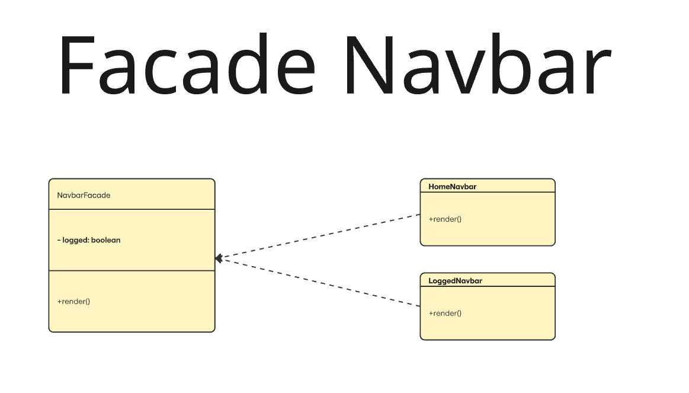
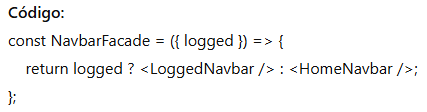

## Facade
O padrão Facade simplifica o uso de sistemas complexos ao oferecer uma interface única e fácil de usar, escondendo os detalhes internos. Ele centraliza a lógica de decisão, reduz o acoplamento e facilita a manutenção do código. É ideal quando queremos alternar entre diferentes comportamentos ou componentes sem expor essa complexidade ao restante da aplicação.

### Modelagem 

### Código 
Segue abaixo o código demonstrando a implementação do Facade

- Encapsula a lógica para escolher e renderizar a navbar correta de forma simples.  

- NavbarFacade sem saber detalhes internos.  

    <table>
        <tr>
            <th>Data</th>
            <th>Versão</th>
            <th>Descrição</th>
            <th>Autor</th>
            <th>Data da Revisão</th>
            <th>Revisor</th>
            <th>Descrição de Revisão</th>
        </tr>
        <tr>
            <td>02/06/2025</td>
            <td>1.0</td>
            <td>Acrescentando diagrama</td>
            <td><a href="https://github.com/daniela.alarcao">Daniela Alarcão</a></td>
            <td>02/06/2025</td>
            <td></td>
            <td>Criação de página + conteúdo</td>
        </tr>
    </table>

